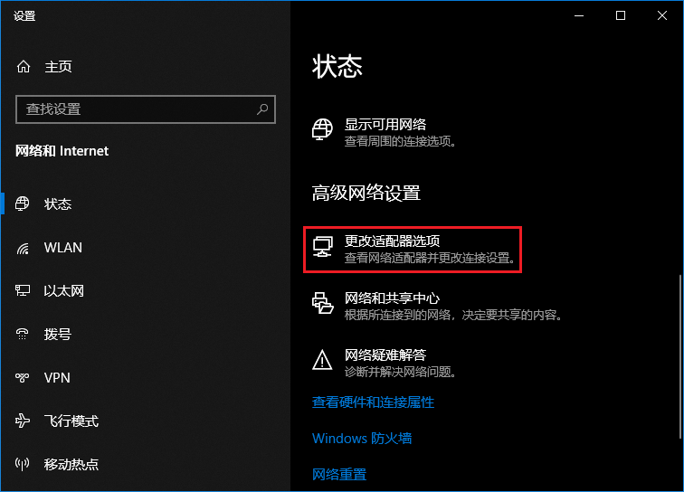
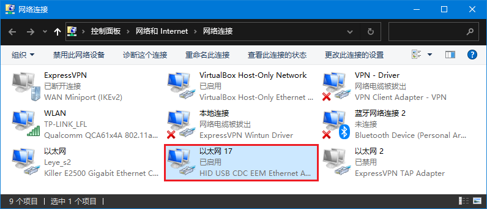
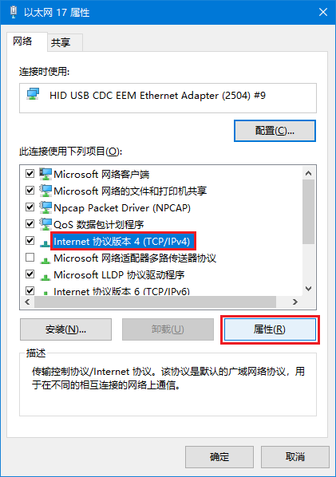
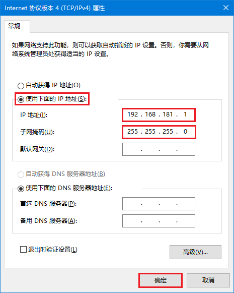

# Windows设置静态IP

这里以Win10为例，Win7可能会有少许不同，但基本操作一致。

1、打开"网络适配器"界面。

快速打开方式：组合键"**Win+X**"，在弹出的菜单中选择"**网络界面**"，然后在弹出的界面中
选择"**更改适配器选项**"。

带有"HID USB CDC EEM..."标识的"以太网 17"（不同电脑，名称可能不同）是AI加速板。

2、选择"以太网 17"**右击**，在弹出的菜单中选择"**属性**"。

3、选择"**Internet 协议版本 4 (TCP/IPv4)**"，点击"**属性**"。

4、在弹出界面中，设置IP为"**192.168.181.1**"，点击"**确定**"退出。

