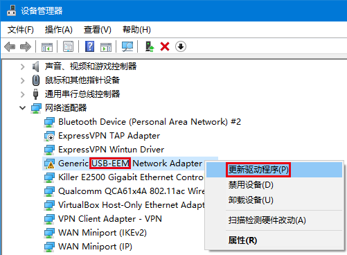
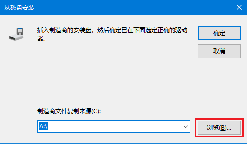

# Windows CDC-EEM 驱动
由于AI加速卡使用的EEM，如果上位机为Windows系统，需安装EEM驱动（Windows自带的通用EEM驱动无法工作）。

本驱动来源于：https://github.com/rawaaw/cdc-eem-f103

该驱动支持:
- Windows 7
- Windows 7 x64
- Windows 8
- Windows 8 x64
- Windows 8 x86
- Windows 8.1 x32
- Windows 8.1 x64
- Windows 10 32-Bit
- Windows 10 64-Bit
- Windows 10 x64
- Windows 10 x86

## 驱动安装
这里以Win10为例，Win7可能会有少许不同，但基本操作一致。

1、下载该项目代码。

2、打开电脑设备管理器（快速打开方式：组合键"**Win+X**"，在弹出的菜单中选择"**设备管理器**"）。

3、将AI加速板（AI摄像头）插入Windows电脑USB接口。

4、AI加速板插入电脑后，设备管理器的网络适配器会多出一个**USB-EEM**的设备（带叹号）；
**右击**该设备，在弹出的对话框中选择"**更新驱动程序**"。

5、选择"**浏览我的电脑以查找驱动程序**"。

6、选择"**让我从计算机的可用驱动程序列表中选取**"

7、选择"**从磁盘安装**"

8、点击"**浏览**"，选择项目目录下的"driver\windows_cdc_eem\x64\hidglobal_cdceem62.inf"打开，
如果是32位操作系统选择"driver\windows_cdc_eem\x86\hidglobal_cdceem62.inf"。

9、点击"**确定**"，然后在弹出的界面中选择型号列表中的第一个，点击"**下一页**"，开始安装驱动。

**注**：安装过程中会提示"更新驱动程序警告"，点击"**是**"。

10、更新驱动完成后，会提示"Windows 已成功更新你的驱动程序"；

同时设备管理器中，该设备不再有叹号。

